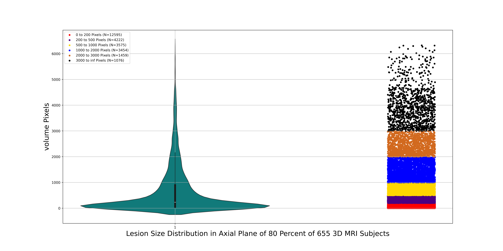
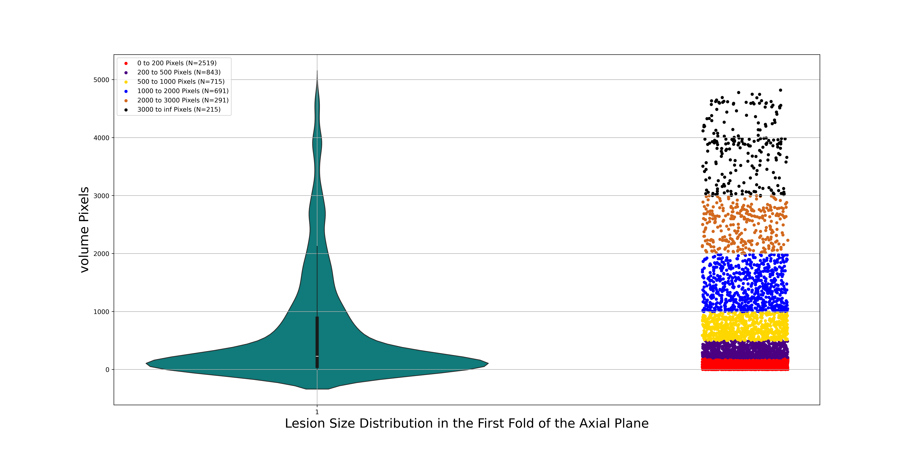
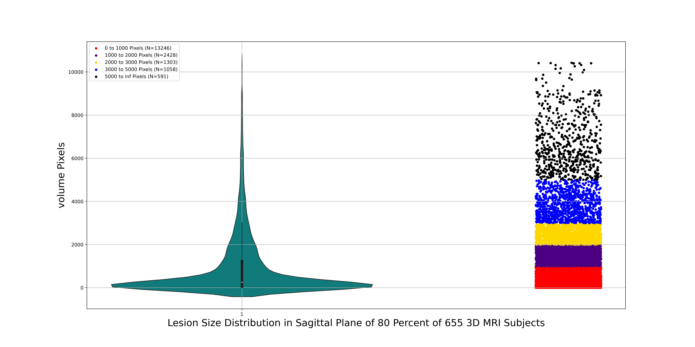
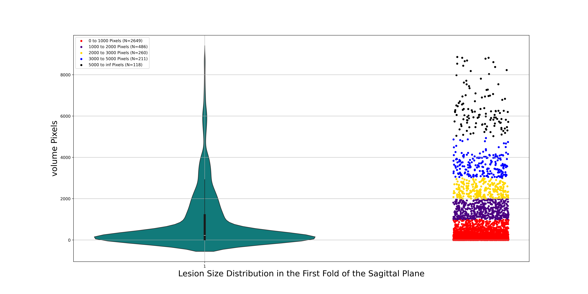
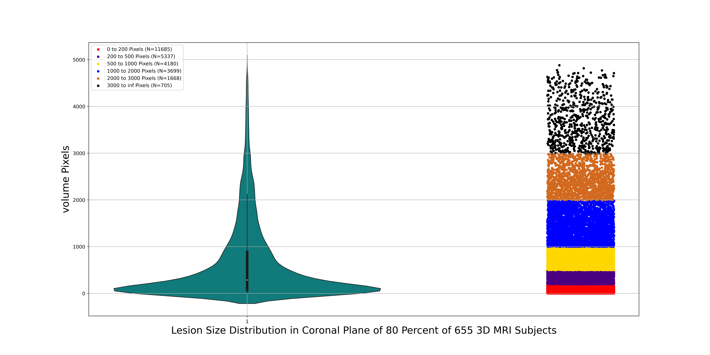
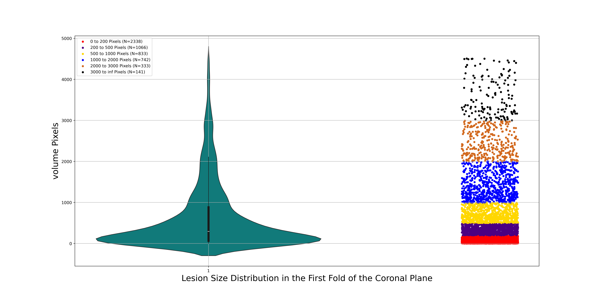

# Cross-Validation

We developed the cross validation for lesion slices and also the normal slices:


# K_Fold For Lesion Slices

For evaluating the model, cross-validation is important. We developed k-fold cross-validation where we split the data into k folds and trained the model k times. 
Each time, we trained the model on k-1 folds and evaluated the model on the remaining 1 fold.

In the previous section, we converted 3D MRI scans into 2D images for Axial, Sagittal, and Coronal planes.
 For generating the k-fold cross-validation for these 2D images, we developed a code to create k-folds for each plane while considering two important factors:

- **In each fold, the lesion size distribution should be the same as the overall distribution, ensuring consistent lesion distribution across all data.**


- **The folds should not overlap. By this, we mean that no slice of one subject should appear in two different folds because if the model learns from slices of the
 same subject during training, evaluating it on other slices of the same subject would not be valid. This would hinder our ability to assess the generalization of the model.**


  To achieve this splitting cross-validation, we developed the following sequence:

 1. For each plane, place the slices into their corresponding bins.
 2. Define K as the number of folds.
 3. Initialization: Randomly choose a slice from the first distribution.
 4. Based on the subject name, look for the same case in other slices.
 5. Repeat the third and fourth steps.


To run the code, execute the script below:

``` 
cd K_Fold_Lesion

python3 axial_k_fold_lesion.py

python3 sagittal_k_fold_lesion.py 

python3 coronal_k_fold_lesion.py 
 

```
The results are saved in the following directory:

- Axial_K_Fold_CSV
- Sagittal_K_Fold_CSV
- Coronal_K_Fold_CSV

> [!IMPORTANT]
> The lesion distribution in all axial/sagittal/coronal plane subjects is the same as the lesion distribution in each fold.
> For clarity, we displayed the lesion distribution for all training subjects and the first fold.

# Lesion Distribution in All Axial Plane Subjects and First Fold

**Distribution in All Axial plane**


 


**Distribution in one Fold Axial plane**




# Lesion Distribution in All Sagittal Plane Subjects and First Fold


**Distribution in All Sagittal plane**


 


**Distribution in one Fold Sagittal plane**




# Lesion Distribution in All Coronal Plane Subjects and First Fold


**Distribution in All Coronal plane**


 


**Distribution in one Fold Coronal plane**




# K_Fold For Normal Slices

In the previous section, we split the data for k-fold cross-validation for lesion slices. In this section, we also split the normal slices (without lesions) for k-fold cross-validation.

The approach is:

1. First, we read each fold for lesions (CSV file).
2. Find the subjects that are in those folds.
3. Find the normal slices in each subject.
4. Add the same number of normal slices near the lesion slices from the same subject.


To run the code, execute the script below:

``` 
cd K_Fold_Normal

python3 axial_sagittal_coronal_k_fold_normal.py

```

