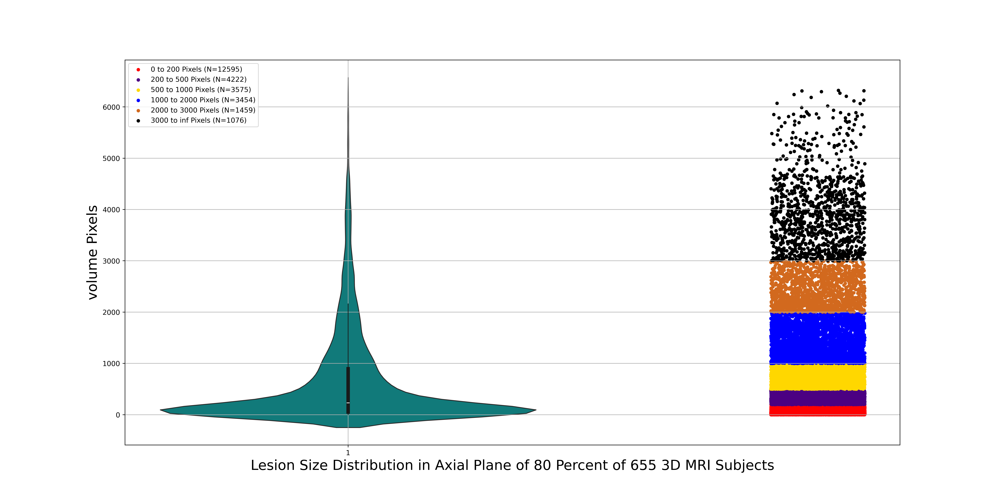
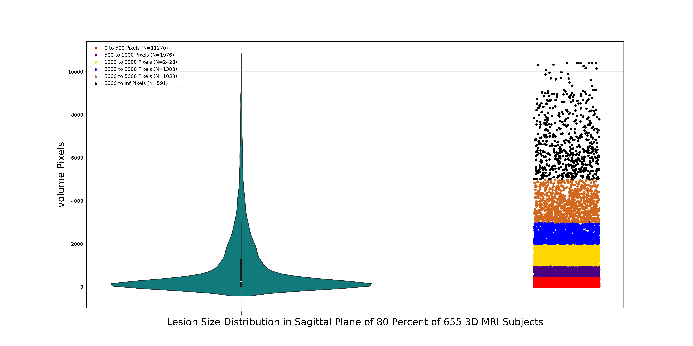
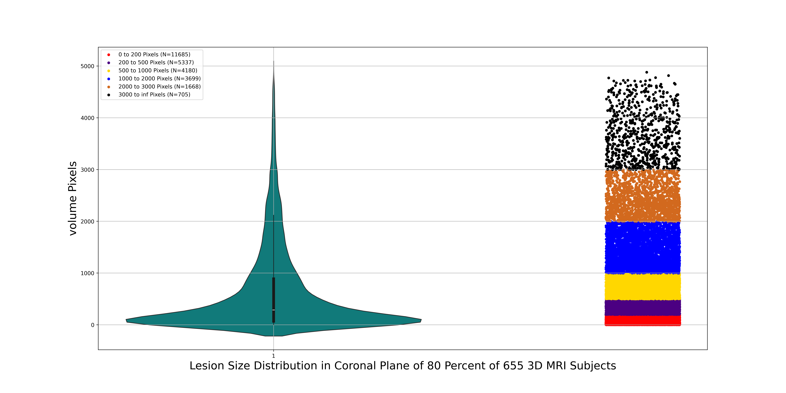

# DATA SPLITTING 

Based on the previous part, we extracted the lesion information from 655 3D MRI scans, including data from the axial, sagittal, and coronal planes, and saved all that information in CSV files.

Now, in this section, we want to split the 3D data into two groups:

- 80% for training and evaluation of 2D models (523/655)
- 20% for evaluation of fusion models (132/655)

The first group consists of 80% of the 655 subjects (524 subjects) and will be used for training and evaluating the 2D proposed model with cross-validation, which we will discuss in the next section. The remaining MRI data will be used for evaluating the proposed fusion model, which combines data from the axial, sagittal, and coronal planes. The fusion model will be described in detail in an upcoming section.

The importance of this part is that we split the data based on the lesion distribution presented in the previous section, ensuring that both groups have the same distribution of lesions.

To run the code, execute the script below:

``` 

python3 spliting_3D_MRI_data.py 

```

The results will be saved in the CSV directory, with the CSV files named as follows:

- Lesion_information_for_80_percent_of_3D_MRI_Subject.csv

- Lesion_information_for_20_percent_of_3D_MRI_Subject.csv


We have also generated CSV files for the axial, sagittal, and coronal planes for the first group. This information is necessary for the next section, which covers cross-validation splitting for training and evaluating the 2D proposed model.


The results are saved in the following CSV files:

- Axial_Lesion_information_for_80_percent_of_3D_MRI_Subject.csv

- Sagittal_Lesion_information_for_80_percent_of_3D_MRI_Subject.csv

- Coronal_Lesion_information_for_80_percent_of_3D_MRI_Subject.csv


``` 

python3 Extraction_lesion_information_of_training_planes.py

```

- Axial_Lesion_information_for_80_percent_of_3D_MRI_Subject.csv 

- Sagittal_Lesion_information_for_80_percent_of_3D_MRI_Subject.csv

- Coronal_Lesion_information_for_80_percent_of_3D_MRI_Subject.csv


# Display Lesion Distribution in 80 Percent of 3D MRI Subjects

The image below represents the lesion size distribution in 80 Percent of  655 3D subjects.

> [!IMPORTANT]
> The ranges used for categorizing the distribution of lesion volume voxels in 3D MRI subjects are represented as labels in the plot below.


 


# Display Lesion Distribution in 20 Percent of 3D MRI Subjects

The image below represents the lesion size distribution in 20 Percent of  655 3D subjects.

> [!IMPORTANT]
> The ranges used for categorizing the distribution of lesion volume voxels in 3D MRI subjects are represented as labels in the plot below.


# Disply Lesion Distribution in 2D Axial Plane of 80 Percent of 3D MRI Subject

The image below represents the lesion size distribution in Axial Plane of 80 Percent of 655 3D MRI Subjects.


> [!IMPORTANT]
> The ranges used for categorizing the distribution of lesion volume Pixels in Axial Plane 3D MRI subjects are represented as labels in the plot below.




# Display Lesion Distribution in 2D Sagittal Plane of 80 Percent of 3D MRI Subject

The image below represents the lesion size distribution in Sagittal Plane of 80 Percent of 655 3D MRI Subjects.

> [!IMPORTANT]
> The ranges used for categorizing the distribution of lesion volume pixels in Sagittal Plane 3D MRI subjects are represented as labels in the plot below.





# Display Lesion Distribution in 2D Coronal Plane of 80 Percent of 3D MRI Subject

The image below represents the lesion size distribution in Coronal Plane of 80 Percent of 655 3D MRI Subjects.

> [!IMPORTANT]
> The ranges used for categorizing the distribution of lesion volume pixels in Coronal Plane 3D MRI subjects are represented as labels in the plot below.




