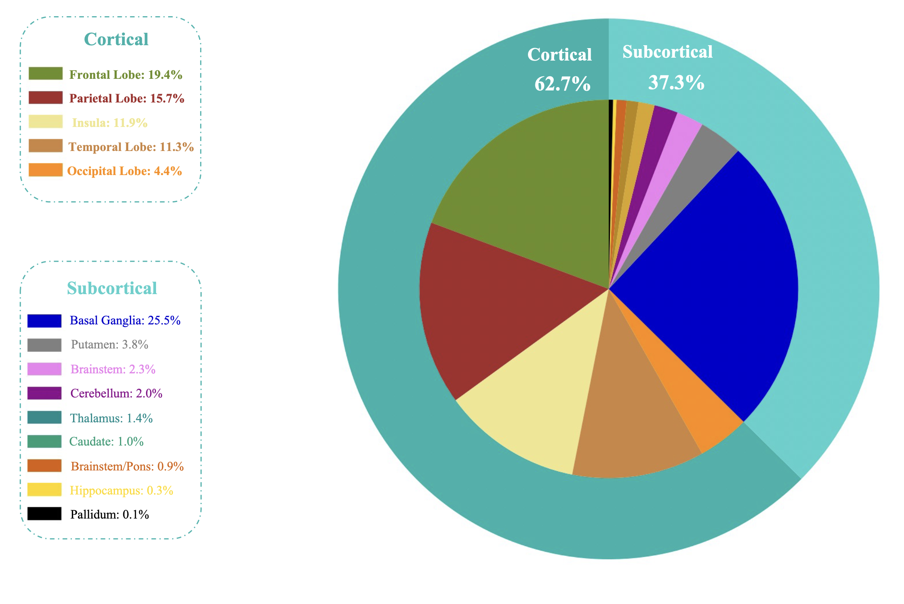

# DATASET

The ATLAS dataset, designed for research purposes, offers a comprehensive compilation of ischemic stroke MRI scans, accompanied by accurately annotated lesion masks.
 This dataset encompasses a total of 955 cases, with 655 subjects having their corresponding ground truth labels available.


## Download ATLAS_2
The ATLAS dataset is available at [ATLAS_2](http://fcon_1000.projects.nitrc.org/indi/retro/atlas.html)

> [!NOTE]
> We did not put the dataset in this repository.

> [!IMPORTANT]
> If you want to regenerate these codes, please put the dataset in this directory of this repository.(Named: ATALS_2)


## Display Lesion Locations in Cortical and Subcortical Regions

The depiction of lesion distribution across different regions within the cortical and subcortical areas is visually presented in this figure.




## Extract Lesion information for 3D MRI Subject

For extracting the information for All 655, 3D MRI run the following code:


``` 

python3 Extract_lesion_information.py --directory=./ATLAS_2/Training --plane=all  

```
The output will save in directory /CSV/ATLAS_Lesion_information_for_3D_MRI_Subject.csv

## Extracting information for Axial plane

For extracting the information for **Axial** plane of  All 655, 3D MRI run the following code:


```

python3 Extract_lesion_information.py --directory=./ATLAS_2/Training --plane=axial

```       
The output will save in directory /CSV/ATLAS_Axial_Lesion_information.csv


## Extracting information for Sagittal plane 


For extracting the information for **Sagittal** plane of  All 655, 3D MRI run the following code:


```

python3 Extract_lesion_information.py --directory=./ATLAS_2/Training --plane=sagittal

```       
The output will save in directory /CSV/ATLAS_Sagittal_Lesion_information.csv


## Extracting information for Coronal plane 


For extracting the information for **Coronal** plane of  All 655, 3D MRI run the following code:


```

python3 Extract_lesion_information.py --directory=./ATLAS_2/Training --plane=coronal

```       
The output will save in directory /CSV/ATLAS_Coronal_Lesion_information.csv


