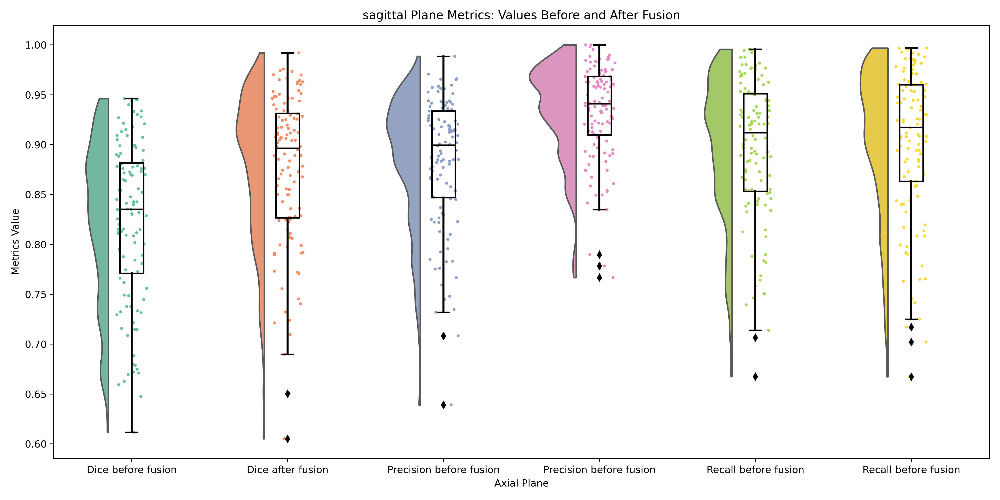
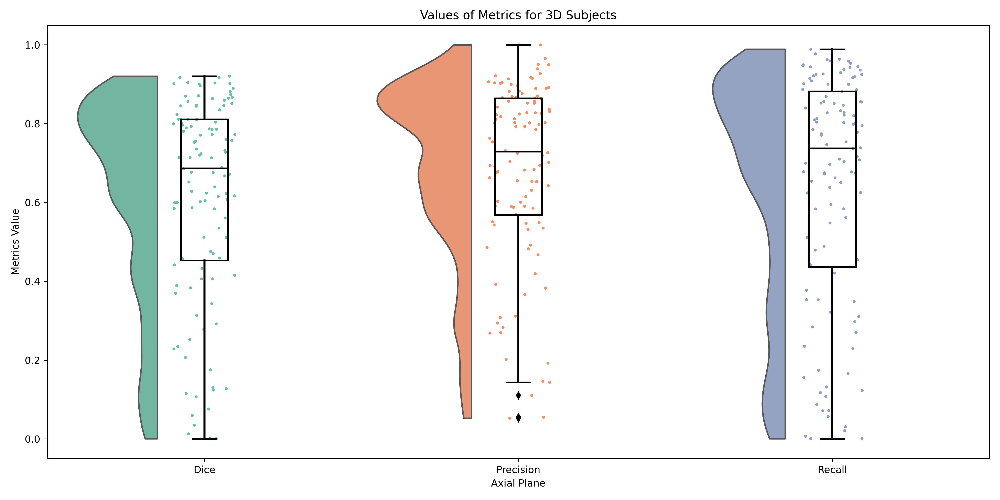

# Fusion

In this part, we apply the fusion approach. For each subject, we decompose the subject into its planes: axial,
 sagittal, and coronal. We then predict for each plane and fuse the results of these planes. The fusion approach involves 
 summing all the prediction values for each plane, and if the average (sum of predictions divided by 3) is greater than 0.5, we classify that pixel as 1.


<!-- 
for applying the fusion, we splitted the data at the first stage to 80% and 20% for training and the evaluation fusion model. 

As a result, we apply this fusion on that evaluation fusion data. We put the data here in directory .data and put the best model performance on the .trained_model directory 

and executive the following code :


python3 fusion.py -data data -models trained_model -save test


-data : Data is directory of data  and should have two subdirectory mri and mask 
        for this dataset the subject in mri and mask should name like this 
        sub-r052s029_ses-1_space-MNI152NLin2009aSym_T1w.nii.gz
        sub-r052s029_ses-1_space-MNI152NLin2009aSym_label-L_desc-T1lesion_mask.nii.gz

-models : This directory is the directory of the trained moldel , the folder should contain axial.h5,sagittal.h5,coronal.h5

-save : the saving directory , The data will save in the saving directory in this format :

        subject_name : 
            - axial: This folder contain the axial_before_fusion.nii, axial_before_fusion.csv (evaluation metrics before fusion applied),
                        axial_after_fusion.csv(evaluation metrics after fusion applied),comparision_before_after_fusion.csv ( compare the mean and std of metrics before and after fusion)

            -sagittal: same as axial but for sagittal plane 
            -coronal: same as axial but for coronal plane 

            -Fusion: segmentation_mask.nii.gz ( The reuslt of segmentation and fusion), fusion_evaluation.csv(Metrics for 3D segmentation)


                    


After the fusion applied for all validation data (112 subject), we calculate the result of fusion on each planes for all the subject, and also evaluate the result of the final segmentation(evaluation for 3d segmentation)

for regenerate this results you cal run this code :

python3 overall_results.csv 

The result of this code saved in overall results which consist 5 csv files:
- axial.cdv (The results of axial before and after fusion)
- sagittal.cdv (The results of sagittal before and after fusion)
- coronal.cdv (The results of coronal before and after fusion)
- Fusion_results.csv (The results of fusion for all 3D subject)
- fusion_subject_result.csv ( The metrics results for each 3d subject)


The result of the planes are : 


Axial 


Sagittal 


Coronal 


The 3D results:  -->


# Fusion Application Instructions

To apply the fusion process, we first split the data into 80% for training and 20% for evaluating the fusion model.

We apply this fusion to the evaluation data. The data is stored in the `.data` directory, and the best model performance is saved in the `.trained_model` directory.

## Execute the Following Command:

```bash
python3 fusion.py -data data -models trained_model -save test

```

-data: This is the directory containing the data. It should have two subdirectories: mri and mask. The dataset should be named in the following format:

mri: sub-r052s029_ses-1_space-MNI152NLin2009aSym_T1w.nii.gz
mask: sub-r052s029_ses-1_space-MNI152NLin2009aSym_label-L_desc-T1lesion_mask.nii.gz
-models: This is the directory containing the trained models. The folder should contain the following files:

axial.h5
sagittal.h5
coronal.h5
-save: This is the directory where the results will be saved. The data will be saved in the following format:


subject_name/
  - axial/
    - axial_before_fusion.nii
    - axial_before_fusion.csv (evaluation metrics before fusion)
    - axial_after_fusion.csv (evaluation metrics after fusion)
    - comparison_before_after_fusion.csv (comparison of mean and std of metrics before and after fusion)
  
  - sagittal/
    - same as axial but for the sagittal plane
  
  - coronal/
    - same as axial but for the coronal plane

  - Fusion/
    - segmentation_mask.nii.gz (result of segmentation and fusion)
    - fusion_evaluation.csv (metrics for 3D segmentation)


After applying fusion to all validation data (112 subjects), we calculate the fusion results for each plane for all subjects and also evaluate the final segmentation results (evaluation for 3D segmentation).

To regenerate these results, run the following command:

```bash
python3 overall_results.py

```

The results of this command will be saved in overall_results, which consists of 5 CSV files:

- axial.csv (results of axial before and after fusion)
- sagittal.csv (results of sagittal before and after fusion)
- coronal.csv (results of coronal before and after fusion)
- Fusion_results.csv (results of fusion for all 3D subjects)
- fusion_subject_result.csv (metrics results for each 3D subject)


# Results

## AXIAL:


|      Fusion   |      Dice      |    Precision    |     Recall     |
| ------------- | -------------- | --------------- | ---------------|
|     Before    |0.8016 +- 0.0761|0.8612 +- 0.0606 |0.8748 +- 0.0803|
|     After     |0.8451 +- 0.0821|0.9019 +- 0.0651 |0.8807 +- 0.0813|


The raincloud:


## SAGITTAL:


|      Fusion   |      Dice      |    Precision    |     Recall     |
| ------------- | -------------- | --------------- | ---------------|
|     Before    |0.8231 +- 0.0806|0.8830 +- 0.0657 |0.8951 +- 0.0725|
|     After     |0.8753 +- 0.0766|0.9331 +- 0.0476 |0.9022 +- 0.0745|

The raincloud:




## CORONAL:


|      Fusion   |      Dice      |    Precision    |     Recall     |
| ------------- | -------------- | --------------- | ---------------|
|     Before    |0.8184 +- 0.0970|0.8984 +- 0.0750 |0.8712 +- 0.0856|
|     After     |0.8633 +- 0.0847|0.9156 +- 0.0687 |0.8987 +- 0.0747|

The raincloud:


## 3D EVALUATION:


|      Number_of subject   |      Dice      |    Precision    |     Recall     | volume_difference   |
| -------------------------| -------------- | --------------- | ---------------|---------------------|
|     112 Subject          |0.6126 +- 0.2577|0.6833 +- 0.2281 |0.6385 +- 0.2963| 6486.5892 +- 9686.75|


The raincloud:



## The 3D view of Fusion

The result of fusion in 3D view is plotted for single subject :

- sub-r010s028_ses-1_space-MNI152NLin2009aSym_T1w.nii.gz


