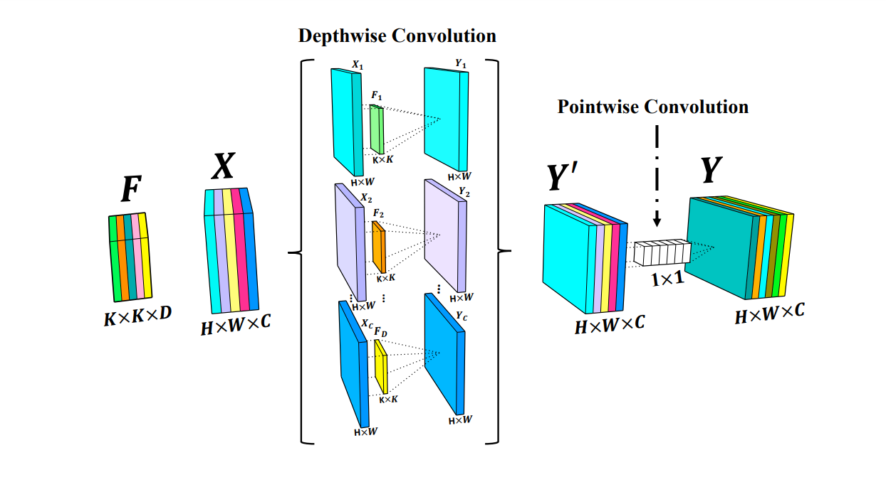

# MODEL 


In this section, we have included all the code for designing and training the model. The model is depicted below, along with the added Seperable convolution.


## Seperable Convolution





This directory contains the following code files:

- **Model.py:** This file contains the model we developed, written using the Keras library.
- **load_data.py:** This script is responsible for loading the numpy data created in the data preparation section.
- **statistic.py:** This script includes all the statistical parameters for training the model, such as the optimizer and loss function.
- **compiler.py:** This script compiles the model for training, applies the optimizer and loss function, handles the data, trains the model, saves the results, checks for overfitting, and saves the best model.
- **train.py:** This script gathers all the aforementioned components to train the model. It allows you to define and tune the model for training.
To train the model, you can run the code in this directory.


```

 python3 train.py \
	--image_size 208 240 \
	--num_classes 1 \
	--folder_directory ../Data_Preparation/Axial/fold_3 \
	--train_mri train_data_mri_fold_3.npy \
	--train_mask train_data_mask_fold_3.npy \
	--validation_mri validation_data_mri_fold_3.npy \
	--validation_mask validation_data_mask_fold_3.npy \
	--loss_function DiceCoefLoss \
	--metrics_names precision recall  hausdorff_distance \
	--epochs 150 \
	 --patients 20 \
	 --checkpoint_path ./result \
	 --checkpoint_name result

```
- **image_size:** Image size of the data (Height, Width)
- **num_classes:** Number of classes
- **folder_directory:** Directory containing the data
- **train_mri:** Training data file (.npy) with shape (number_of_data, batch_size, height, width, 1)
- **train_mask:** Training mask file where each index corresponds to a train MRI
- **validation_mri:** Validation data file (.npy) with shape (number_of_data, batch_size, height, width, 1)
- **validation_mask:** Validation mask file where each index corresponds to a validation MRI
- **loss_function:** Choice of loss function; options are ['FocalTverskyLoss', 'FocalLoss', 'TverskyLoss', 'DiceCoefLoss']
- **metrics_name:** Metrics for evaluating the model; options are ['precision', 'recall', 'accuracy', 'hausdorff_distance', 'dice_coef']
- **epochs:** Number of epochs for training
- **patience:** Number of epochs to wait for improvement in loss before stopping the training
- **checkpoint_path:** Path to save the results (csv and model weights)
- **checkpoint_name:** Name for the saved csv and .h5 file


