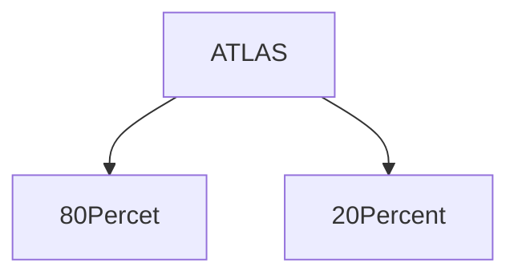
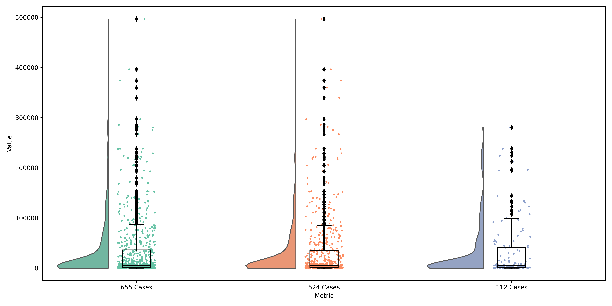
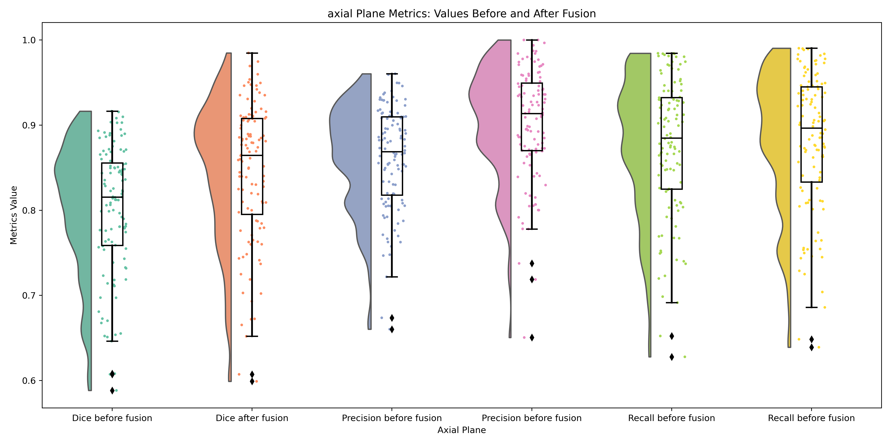
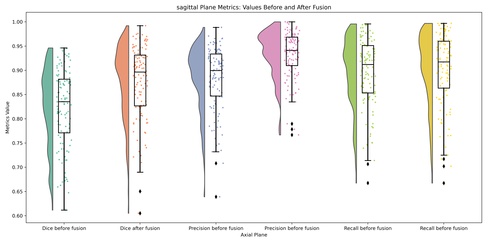
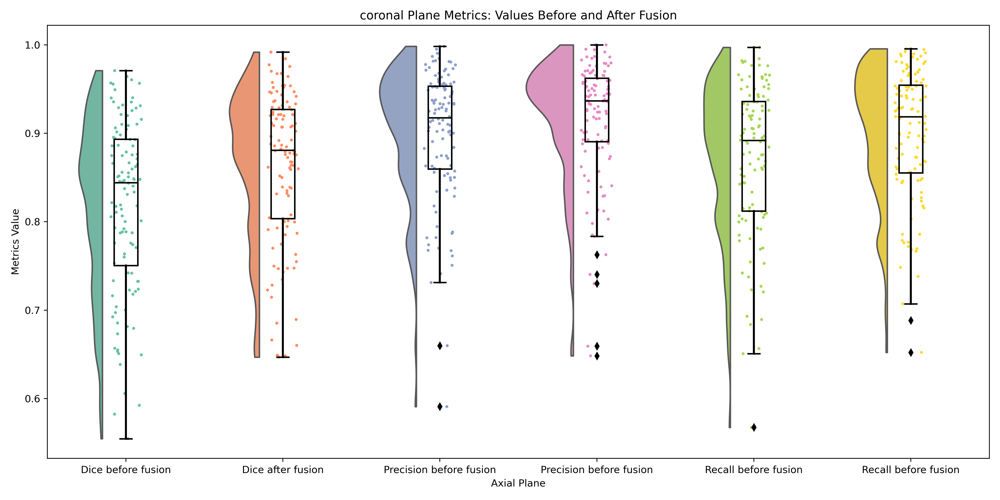
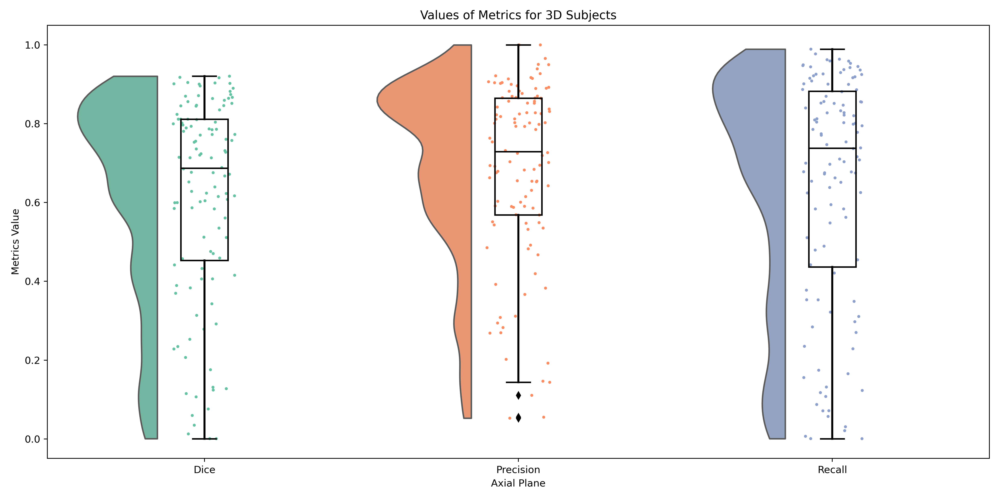

# RESIDUAL ATTENTION XEPTION NETWROK
In this repository, we introduce a new architecture based on a deep learning model for segmenting ischemic strokes in T1 MRI modality.
 For more details, please refer to the README below and ensure that each section is followed completely. Also, ensure that each section is 
 completed before proceeding to the next section, as this approach follows a sequential manner.


# ISCHEMIC STROKE

When the blood supply to the brain is obstructed by a cloth, there is insufficient oxygen delivery to brain tissues, resulting in cellular necrosis. 
 In healthcare settings, it is imperative to identify and delineate the boundaries of ischemic lesions to facilitate treatment and surgical planning. 
 Stroke, also referred to as a cerebrovascular accident, is a prevalent neurological disorder worldwide. Additionally, stroke ranks as the second primary contributor to mortality. 


# REQUIREMENTS 

 Before starting, please ensure that all the requirements listed below are installed on your local PC or server.
 After downloading this repository, navigate to the main directory and execute the following command in your terminal. (Linux is the preferred operating system for this project.)


```
pip install -r requirements.txt

```
Also, You need to install tensorflow for GPU. You can install it by the following link.


For this prject we used the following version of tensorflow and keras:

[Install Tensorflow](https://www.tensorflow.org/install/pip)


```
tensorflow == 2.14.0
keras == 2.14.0 
```

# PIPLINE 

The pipeline of this project is listed in below.

 - [ ] **[Dataset](./Dataset)** 

- [ ] **[Data_Splitting](./Data_Splitting)** 

- [ ] **[Moving_Converting_data](./Moving_Converting_Data)**  
 
- [ ] **[Batch-Distribution](./Distribution)**  

- [ ] **[Data Preparation](./Data_Preparation) ** 

- [ ] **[Model](./Model)** 

- [ ] **[Loss_Comparison](./Loss_Comparison)** 

- [ ] **[Training](./Training)** 

- [ ] **[Model_Comparision](./Model_Comparison/)**

- [ ] **[Model_Results](./Model_Results/)**

- [ ] **[Fusion](./Fusion/)**

- [ ] **[Docker](./Docker/)**


# [Dataset](./Dataset)

The ATLAS dataset, designed for research purposes, offers a comprehensive compilation of ischemic stroke MRI scans, accompanied by accurately annotated lesion masks.
 This dataset encompasses a total of 955 cases, with 655 subjects having their corresponding ground truth labels available.

Lesion Locations in Cortical and Subcortical Regions in ATLAS_2:


 
In this section we covered these: 

+ Download ATLAS 

+ Display Lesion Locations in Cortical and Subcortical Regions

+ Extract Lesion Information For 3D MRIs Subjects

+ Extract Lesion Information For 2D Planes (Axial, Sagittal, Coronal)

+ Disply Lesion Dirstibution in 3D MRIs Subjects

+ Disply Lesion Distribution in 2D Planes


> [!TIP]
> For developing your own use and for comprehensive details, please read the information in the [Dataset directory](./Dataset).


> [!NOTE]
>  The output of this part are CSV files, which contain the dataset information for **ALL** 3D subject and also for Axial,Sagittal and Coronal Planes.
>   The information are included the lesion size and distribution.


# [Data_Splitting](./Data_Splitting)

In this section, based on the extracted information in the previous section, we split the 3D MRI data into two groups:

- 80% for training and evaluation of 2D models
- 20% for evaluation of the fusion model that we discuss further in this readme



**The image below represents the lesion size distribution in 80 Percent of  655 3D subjects.**

> [!IMPORTANT]
> The ranges used for categorizing the distribution of lesion volume voxels in 3D MRI subjects are represented as labels in the plot below.


 


**The image below represents the lesion size distribution in 20 Percent of  655 3D subjects.**

> [!IMPORTANT]
> The ranges used for categorizing the distribution of lesion volume voxels in 3D MRI subjects are represented as labels in the plot below.


**The image below represents the lesion size distribution in 80 and 20 Percent of  655 3D subjects in single plot .**





For more information about this splitting, please go to the [Data_Splitting](./Data_Splitting) directory.


# [Moving_Converting_data](./Moving_Converting_Data)

In this section, we developed the code to use the CSV files generated in the previous section to move 80% and 20% of the data to their respective folders.
 Additionally, we converted the 80% of the data into 2D slices for each plane: axial, sagittal, and coronal.


# [Cross-Validation](./Cross_Validation)

For evaluating the model, cross-validation is important. We developed k-fold cross-validation where we split the data into k folds and trained the model k times.
 Each time, we trained the model on k-1 folds and evaluated the model on the remaining 1 fold.

In the previous section, we converted 3D MRI scans into 2D images for Axial, Sagittal, and Coronal planes. 
For generating the k-fold cross-validation for these 2D images, we developed a code to create k-folds for each plane while considering two important factors:


- **In each fold, the lesion size distribution should be the same as the overall distribution, ensuring consistent lesion distribution across all data.**

- **The folds should not overlap. By this, we mean that no slice of one subject should appear in two different folds because if the model learns from slices of the same subject during training, 
evaluating it on other slices of the same subject would not be valid. This would hinder our ability to assess the generalization of the model.**

We developed the code taking these two considerations into account to generate k-fold cross-validation data. You can use this code for this dataset and your own projects.

> [!IMPORTANT]
> After splitting data to K-fold, each fold has a same lesion distribution as the distribution of all data.
> For instance, we display here the lesion distribution in all data in axial plane and one fold of axial plane.


> [!NOTE]
> [The Mann–Whitney U test](https://en.wikipedia.org/wiki/Mann%E2%80%93Whitney_U_test)  is a nonparametric test of the null hypothesis. We used this test 
> For represent the distribution similarity after cross validation. For all of them P_value > 0.05.


*

For the rest of plane please refere to cross-validation directory.


**Distribution in All Axial plane**


 


**Distribution in one Fold Axial plane**


For more details about this code and how to generate it, please refer to the [cross-validation](./Cross_Validation) directory.


# [Batch-Distribution](./Distribution)

In the last section, we generated CSV files for K-fold cross-validation. 
To train the model, we train it on K-1 folds and test it on one fold.
 This one fold serves as the test and validation data for the model.
 (We cannot define validation in the K-1 fold training data because doing so would result in overlapping between training and validation sets.)

> [!IMPORTANT]
> By overlapping, means that there are diffrent slice of single Subjcet in Train and validation.


To train the model, we define the batch size, and the training data is split into batches of that size.
 After each batch, the parameters of the training model are updated. The common way to split data into batches is to shuffle the data first, then split and feed it to the model.

In this part, we do not shuffle the data for batch splitting; instead, we design our own batches.
 The approach is to split the data based on the lesion distribution of the K-1 fold of training. 
This means that based on the lesion distribution of the training data, we design the batches to ensure that each batch has the same distribution of input data.


### Why Distribution Batch? 
 

In our segmentation model design, our primary aim is to train the model on batches that mirror the overall distribution of lesion masks in the entire dataset.
 Instead of enforcing a uniform distribution within each batch, our strategy focuses on ensuring that the distribution of lesion masks in each batch closely resembles
 that of the entire dataset.


The specific objective is to maintain consistency in the distribution of lesion masks across batches during training.
 Each batch processed by the model contains a proportional representation of different types of lesions, preserving the overall distribution observed in the entire dataset.

The rationale behind this approach are :


1. **Preserving Data Characteristics:**
 
 By aligning the distribution of lesion masks in each batch with that of the entire dataset, we aim to preserve the
 inherent characteristics and diversity of lesion instances present in the data.
 This approach ensures that the model receives a representative sample of lesion types in each batch, facilitating comprehensive learning and generalization.

2. **Improved Optimization:**

Training the model on batches with lesion mask distributions aligned with the entire dataset enhances optimization.
By providing batches that reflect the diversity of lesion instances present in the data, 
the model's optimizer can more effectively navigate the parameter space, leading to smoother convergence and improved performance.

3. **Optimizing Batch Normalization Performance:**

Batch normalization layers rely on consistent batch statistics to normalize activations within the network. 
By maintaining a distribution of lesion masks in each batch that mirrors the overall dataset distribution,
 we enable batch normalization to accurately estimate batch statistics and effectively regulate the flow of information through the model.


For more details, please refer to the [Distribution Batch](./Distribution_Batch) directory.


# [Data Preparation](./Data_Preparation)  

In previous section we categorized data based on the distribution of data in batches for the reason that we dissuced in previous section.
in This section we developed the code for read the data based on that categorized batches for training model and generate a numpy arry for all 
data to load the data for training and evaluation model easily .
Also, we should mention that all data after loading normilzed between 0 to 255 as float and put it in numpy array.

 The numpy array has a shape of (maximum_batch, batch_size, image.shape[0], image.shape[1], image.shape[2], 1).

We also add the code for loading data with out batch distribution.
 The numpy array has a shape of (maximum_batch * batch_size, image.shape[0], image.shape[1], image.shape[2], 1).


for more details, please refer to the [Data Preparation](./Data_Prepration).


# [Model](./Model)

In this section, we introduce a new model and architecture based on deep learning for segmentation, especially stroke segmentation.

The model comprises convolution, depthwise convolution, and residual connections (new residual connections). 
The model has a downsampling part and an upsampling part for extracting information in the downsampling part and reconstruction in the upsampling part.

In this directory, the model and other parameters for training the model are included. 
For more concepts and understanding, the model is depicted in the plot below. Additionally, the architecture of the depthwise convolution is also plotted in this directory.

For more details about the model and approaches, it is better to read the article that we wrote.

For more details about the code and model, please refer to the [Model](./Model) directory.


> [!IMPORTANT]
> In this section, you are able to run the model for training.


# [Loss_Comparison](./Loss_Comparison)


In the previous section, we introduced a new loss function named FocalTverskyLoss,
 which combines the focal loss function and the Tversky loss function. In this section,
 we apply and train the model on a single fold of axial data using four different loss functions:
 Dice coefficient, focal loss, Tversky loss, and our new FocalTverskyLoss. We then compare the results on
 the validation data using metrics such as recall, precision, and the Dice coefficient. Our results demonstrate that the FocalTverskyLoss generally performs better overall.

for more details, please refer to the # [Loss_Comparison](./Loss_Comparison) directory.


# [Training](./Training)

In this part, we aim to train the proposed model for axial, sagittal, and coronal planes. 
For each plane, the model will be trained, and the results will be saved in a CSV file in the directory. 
The weights will also be saved in that directory for future use.

For more details about the training, please refer to the [Training](./Training) directory.


# [Model_Comparision](./Model_Comparison/)

In this part, we reimplement other state-of-the-art methods in lesion stroke segmentation,
 specifically for brain lesion strokes in T1 images, for comparison.

We use their code as a model and train the models on our dataset to ensure the comparison is fair.
 Additionally, we train all models for all planes and folds. In the results, we compare their performance with our model across all planes and folds


The model that used for comparison are : 

- D-Unet[^1] 
- CLCI[^2] 
- X-net[^3] 

[^1]: D-UNet: a dimension-fusion U shape network for chronic stroke lesion segmentation. [Article](https://arxiv.org/pdf/1908.05104)
[^2]: CLCI-Net: Cross-Level fusion and Context Inference Networks for Lesion Segmentation of Chronic Stroke[Article](https://arxiv.org/pdf/1907.07008)
[^3]: X-Net: Brain Stroke Lesion Segmentation Basedon Depthwise Separable Convolution and Long-range Dependencies [Article](https://arxiv.org/pdf/1907.07000)


# [Model_Results](./Model_Results/)

"In this section, we present the results of the proposed model for axial, sagittal, and coronal views. We used the trained model to predict the validation data and evaluated the results using various metrics. The results are reported in this directory, and a summary of the results is also provided here.

For more details, please refer to the [Model_Results](./Model_Results/)directory.

# Axial

The Result of Axial: 


|      Folds    |      Dice      |       Recall    |   Precision    |             Average Score             |
| ------------- | -------------- | --------------- | ---------------|---------------------------------------|
|     Fold_1    |0.6878 +- 0.3762|0.8055 +- 0.3291 |0.7713 +- 0.3324|(0.6878 + 0.8055 + 0.7713) / 3 = 0.7549|
|     Fold_2    |0.7047 +- 0.3792|0.7674 +- 0.3606 |0.8391 +- 0.2832|(0.7047 + 0.7674 + 0.8391) / 3 = 0.7704|
|     Fold_3    |0.7282 +- 0.3558|0.7958 +- 0.3355 |0.8269 +- 0.2808|(0.7282 + 0.7958 + 0.8269) / 3 = 0.7836|
|     Fold_4    |0.7209 +- 0.3684|0.7753 +- 0.3533 |0.8515 +- 0.2678|(0.7209 + 0.7753 + 0.8515) / 3 = 0.7826|
|     Fold_5    |0.7104 +- 0.3776|0.7567 +- 0.3675 |0.8638 +- 0.2559|(0.7104 + 0.7567 + 0.8638) / 3 = 0.7770|
|   All_Folds   |0.7104 +- 0.0127|0.7801 +- 0.0164 |0.8305 +- 0.0292|                                       |


Best Fold for Axial Plane: Fold 3 (Highest Average Score: 0.7836)


# Coronal

The Result of Coronal: 


|      Folds    |      Dice      |       Recall    |   Precision    |             Average Score             |
| ------------- | -------------- | --------------- | ---------------|---------------------------------------|
|     Fold_1    |0.6579 +- 0.3990|0.7605 +- 0.3735 |0.7844 +- 0.3301|(0.6579 + 0.7605 + 0.7844) / 3 = 0.7343|
|     Fold_2    |0.6918 +- 0.3802|0.7665 +- 0.3569 |0.8161 +- 0.3033|(0.6918 + 0.7665 + 0.8161) / 3 = 0.7581|
|     Fold_3    |0.6932 +- 0.3843|0.7451 +- 0.3769 |0.8512 +- 0.2704|(0.6932 + 0.7451 + 0.8512) / 3 = 0.7632|
|     Fold_4    |0.6994 +- 0.3810|0.7620 +- 0.3627 |0.8376 +- 0.2874|(0.6994 + 0.7620 + 0.8376) / 3 = 0.7663|
|     Fold_5    |0.6953 +- 0.3861|0.7402 +- 0.3801 |0.8701 +- 0.2519|(0.6953 + 0.7402 + 0.8701) / 3 = 0.7685|
|   All_Folds   |0.6875 +- 0.0137|0.7549 +- 0.0093 |0.8319 +- 0.0269|                                       |
           

Best Fold for Coronal Plane: Fold 5 (Highest Average Score: 0.7685)


# Sagittal

The Result of Sagittal: 


|      Folds    |      Dice      |       Recall    |   Precision    |             Average Score             |
| ------------- | -------------- | --------------- | ---------------|---------------------------------------|
|     Fold_1    |0.6260 +- 0.3996|0.6931 +- 0.3889 |0.7838 +- 0.3313|(0.6260 + 0.6931 + 0.7838) / 3 = 0.7010|
|     Fold_2    |0.6058 +- 0.4159|0.6685 +- 0.4100 |0.8236 +- 0.3064|(0.6058 + 0.6685 + 0.8236) / 3 = 0.6993|
|     Fold_3    |0.6527 +- 0.3947|0.7062 +- 0.3879 |0.8305 +- 0.2841|(0.6527 + 0.7062 + 0.8305) / 3 = 0.7298|
|     Fold_4    |0.6178 +- 0.3992|0.7302 +- 0.3781 |0.7492 +- 0.3447|(0.6178 + 0.7302 + 0.7492) / 3 = 0.6991|
|     Fold_5    |0.6063 +- 0.3989|0.7297 +- 0.3738 |0.7346 +- 0.3537|(0.6063 + 0.7297 + 0.7346) / 3 = 0.6902|
|   All_Folds   |0.6217 +- 0.0157|0.7055 +- 0.0212 |0.7843 +- 0.0350|                                       |


Best Fold for Sagittal Plane: Fold 3 (Highest Average Score: 0.7298)


# [Fusion](./Fusion/)

In this part, we apply the fusion approach. For each subject, we decompose the subject into its planes: axial,
 sagittal, and coronal. We then predict for each plane and fuse the results of these planes. The fusion approach involves 
 summing all the prediction values for each plane, and if the average (sum of predictions divided by 3) is greater than 0.5, we classify that pixel as 1.

For more details, please refer to the [fusion](./Fusion/) directory.


## AXIAL:


|      Fusion   |      Dice      |    Precision    |     Recall     |
| ------------- | -------------- | --------------- | ---------------|
|     Before    |0.8016 +- 0.0761|0.8612 +- 0.0606 |0.8748 +- 0.0803|
|     After     |0.8451 +- 0.0821|0.9019 +- 0.0651 |0.8807 +- 0.0813|


The raincloud:



## SAGITTAL:


|      Fusion   |      Dice      |    Precision    |     Recall     |
| ------------- | -------------- | --------------- | ---------------|
|     Before    |0.8231 +- 0.0806|0.8830 +- 0.0657 |0.8951 +- 0.0725|
|     After     |0.8753 +- 0.0766|0.9331 +- 0.0476 |0.9022 +- 0.0745|

The raincloud:




## CORONAL:


|      Fusion   |      Dice      |    Precision    |     Recall     |
| ------------- | -------------- | --------------- | ---------------|
|     Before    |0.8184 +- 0.0970|0.8984 +- 0.0750 |0.8712 +- 0.0856|
|     After     |0.8633 +- 0.0847|0.9156 +- 0.0687 |0.8987 +- 0.0747|

The raincloud:




## 3D EVALUATION:


|      Number_of subject   |      Dice      |    Precision    |     Recall     | volume_difference   |
| -------------------------| -------------- | --------------- | ---------------|---------------------|
|     112 Subject          |0.6126 +- 0.2577|0.6833 +- 0.2281 |0.6385 +- 0.2963| 6486.5892 +- 9686.75|


The raincloud:



# [Docker](./Docker/)

The final aspect of this segmentation model is providing a Docker container. The Docker container allows other users to use the model without needing to install any dependencies or libraries. This Docker setup is useful for those who want to use the model with their own data.

To use the Docker container, you need to clone this repository and change the directory to the Docker directory. You need to install Docker on your system. It's easy to install, and you can check the tutorial on Docker's main website.

Then, download the trained weights model from the following link.

After that, place the three trained models (axial.h5, sagittal.h5, coronal.h5) in the trained_models folder in the Docker directory. Then, put your data in the ./data directory and run the following commands.

First, build the Docker image:


```
docker build -t rux .

```
Then, run the Docker container:


```
docker run -v $(pwd)/results:/results -p 4000:80 rux

```

The results will be saved in the results directory.

Your data should be in the size of (197, 233, 189). If it is not in this size, use FreeSurfer to resample your data. The command in FreeSurfer is:


mri_convert --reslice_like reference.nii input.nii output.nii


