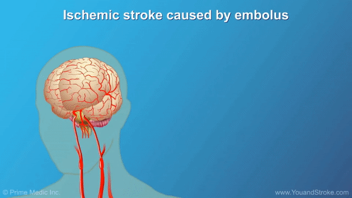

# RESIDUAL ATTENTION XEPTION NETWROK
In this repository, we introduce a new architecture based on a deep learning model for segmenting ischemic strokes in T1 MRI modality.
 For more details, please refer to the README below and ensure that each section is followed completely. Also, ensure that each section is 
 completed before proceeding to the next section, as this approach follows a sequential manner.


# ISCHEMIC STROKE

When the blood supply to the brain is obstructed by a cloth, there is insufficient oxygen delivery to brain tissues, resulting in cellular necrosis. 
 In healthcare settings, it is imperative to identify and delineate the boundaries of ischemic lesions to facilitate treatment and surgical planning. 
 Stroke, also referred to as a cerebrovascular accident, is a prevalent neurological disorder worldwide. Additionally, stroke ranks as the second primary contributor to mortality. 



# REQUIREMENTS 

 Before starting, please ensure that all the requirements listed below are installed on your local PC or server.
 After downloading this repository, navigate to the main directory and execute the following command in your terminal. (Linux is the preferred operating system for this project.)


```
pip install -r requirements.txt

```
Also, You need to install tensorflow for GPU. You can install it by the following link.


For this prject we used the following version of tensorflow and keras:

[Install Tensorflow](https://www.tensorflow.org/install/pip)


```
tensorflow == 2.16.1
keras == 3.3.3 
```

# PIPLINE 

The pipeline of this project is listed in below.
 
- [ ] **Dataset** (Download, Explaination of data, Exctraction of information eg. lesion distribution)

- [ ] **Spliting Data** (Based on the previously extracted information, split the data for cross-validation) 

- [ ] **Transmition of Data** ( Copying and convert 3D MRI to 2D slices)

- [ ] **Read/Prepare Data for Training and Evaluation** ( Read based on cross-validation spliting and save as arrays)

- [ ] **Prepare the Model of Training** (Design the model and set model hyperparameters)

- [ ] **Train the Model** 

- [ ] **Results for Each Planes**

- [ ] **Other satates of art** 

- [ ] **Applying Fusion** 

- [ ] **Fusion Result**

- [ ] **The Weighted and Saved model for Use** 

- [ ] **Docker** ( For ease of use, we developed the docker composer to easly use the model) 


# [Dataset](./Dataset)

The ATLAS dataset, designed for research purposes, offers a comprehensive compilation of ischemic stroke MRI scans, accompanied by accurately annotated lesion masks.
 This dataset encompasses a total of 955 cases, with 655 subjects having their corresponding ground truth labels available.
 
In this section we covered these: 

+ Download ATLAS 

+ Display Lesion Locations in Cortical and Subcortical Regions

+ Extract Lesion Information For 3D MRIs Subjects

+ Extract Lesion Information For 2D Planes (Axial, Sagittal, Coronal)

+ Disply Lesion Dirstibution in 3D MRIs Subjects

+ Disply Lesion Distribution in 2D Planes


> [!TIP]
> For developing your own use and for comprehensive details, please read the information in the [dataset directory](./Dataset)


