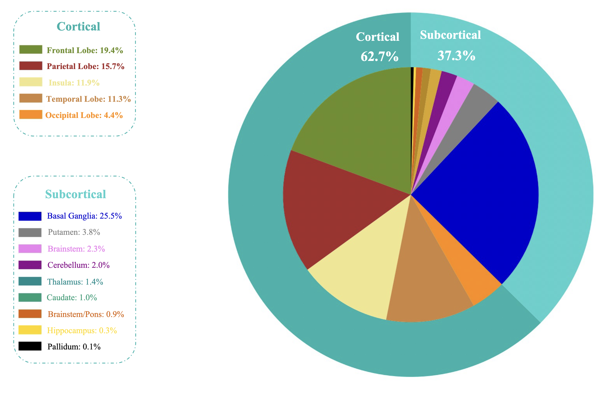
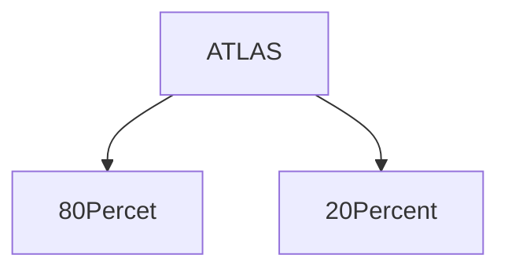
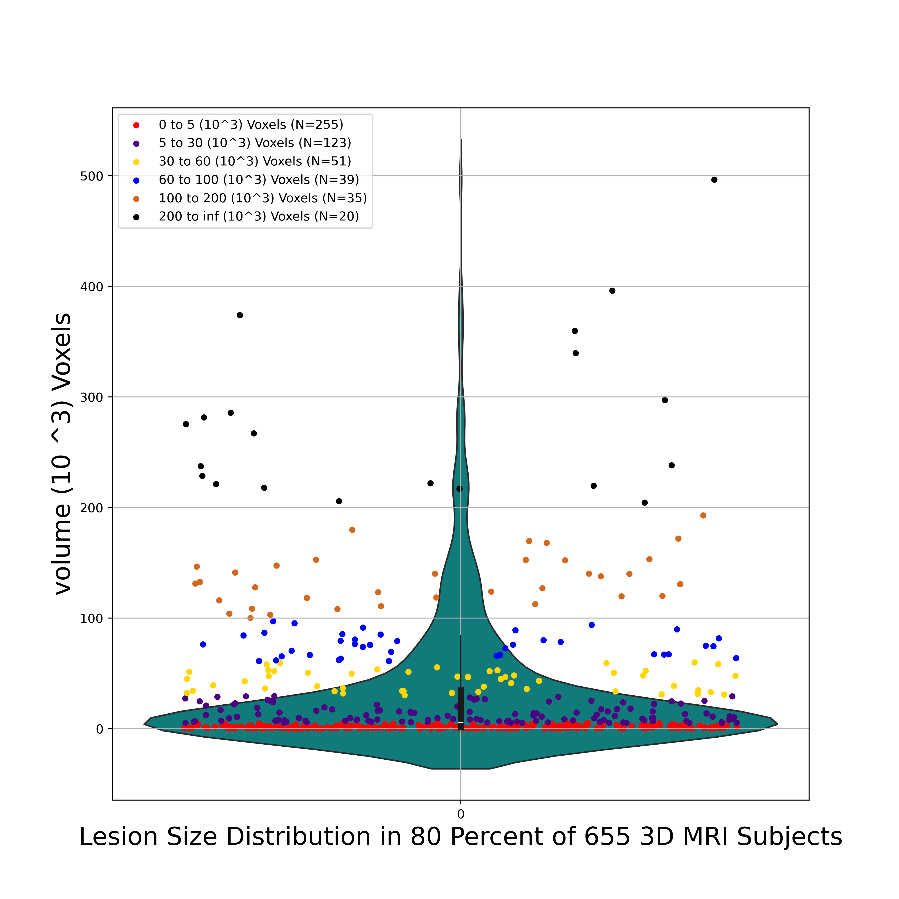
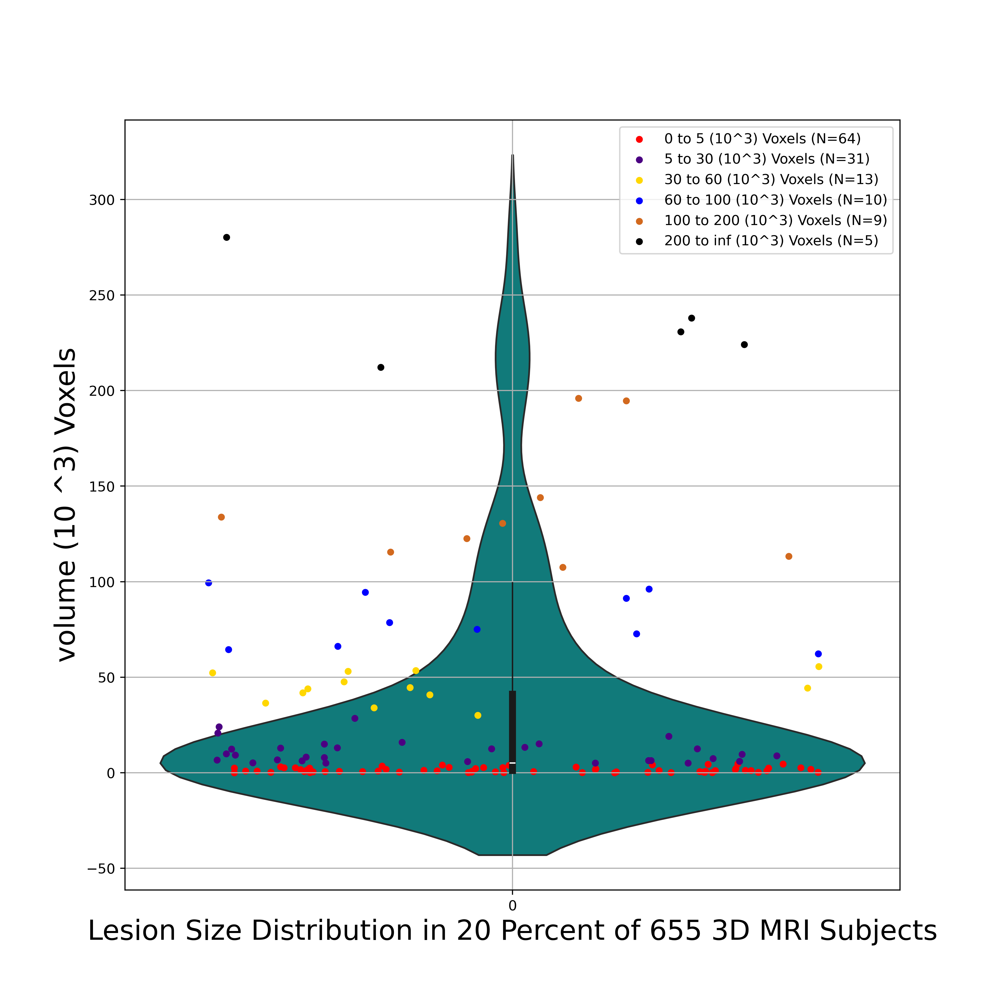
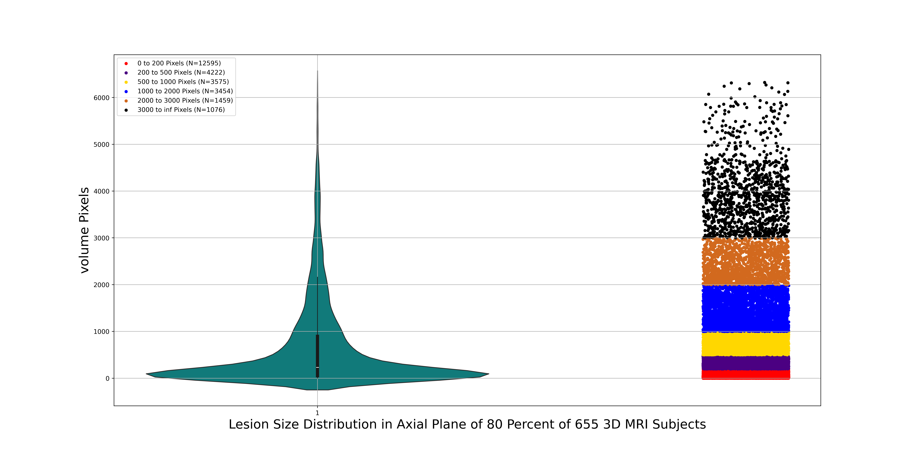
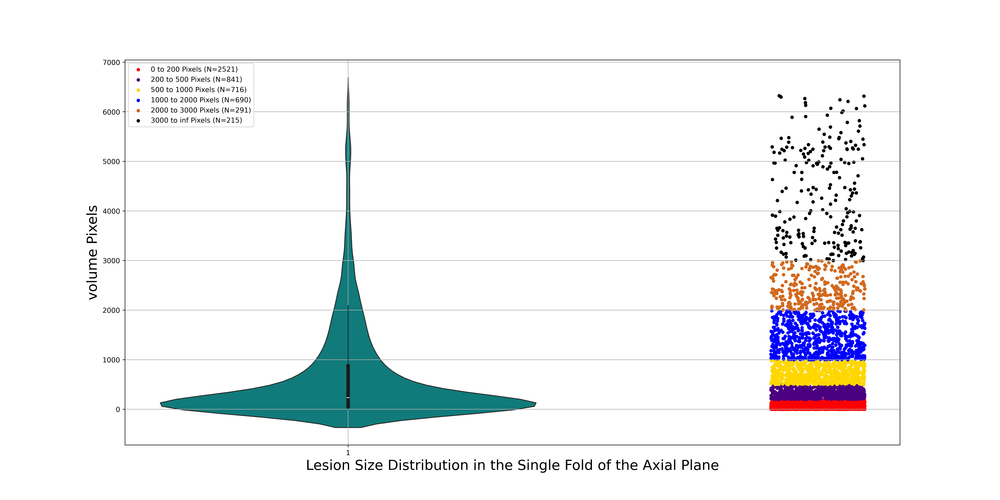

# RESIDUAL ATTENTION XEPTION NETWROK
In this repository, we introduce a new architecture based on a deep learning model for segmenting ischemic strokes in T1 MRI modality.
 For more details, please refer to the README below and ensure that each section is followed completely. Also, ensure that each section is 
 completed before proceeding to the next section, as this approach follows a sequential manner.


# ISCHEMIC STROKE

When the blood supply to the brain is obstructed by a cloth, there is insufficient oxygen delivery to brain tissues, resulting in cellular necrosis. 
 In healthcare settings, it is imperative to identify and delineate the boundaries of ischemic lesions to facilitate treatment and surgical planning. 
 Stroke, also referred to as a cerebrovascular accident, is a prevalent neurological disorder worldwide. Additionally, stroke ranks as the second primary contributor to mortality. 


# REQUIREMENTS 

 Before starting, please ensure that all the requirements listed below are installed on your local PC or server.
 After downloading this repository, navigate to the main directory and execute the following command in your terminal. (Linux is the preferred operating system for this project.)


```
pip install -r requirements.txt

```
Also, You need to install tensorflow for GPU. You can install it by the following link.


For this prject we used the following version of tensorflow and keras:

[Install Tensorflow](https://www.tensorflow.org/install/pip)


```
tensorflow == 2.16.1
keras == 3.3.3 
```

# PIPLINE 

The pipeline of this project is listed in below.

 
- [ ] **Dataset** (Download, Explaination of data, Exctraction of information eg. lesion distribution)

- [ ] **Data Spliting** (Based on the previously extracted information, split the 3D data)

- [ ] **Cross-Validation** (Bas on previous section, develop cross-validation for training the model)

- [ ] **Transmition of Data** ( Copying and convert 3D MRI to 2D slices)

- [ ] **Read/Prepare Data for Training and Evaluation** ( Read based on cross-validation spliting and save as arrays)

- [ ] **Prepare the Model of Training** (Design the model and set model hyperparameters)

- [ ] **Train the Model** 

- [ ] **Results for Each Planes**

- [ ] **Other satates of art** 

- [ ] **Applying Fusion** 

- [ ] **Fusion Result**

- [ ] **The Weighted and Saved model for Use** 

- [ ] **Docker** ( For ease of use, we developed the docker composer to easly use the model) 


# [Dataset](./Dataset)

The ATLAS dataset, designed for research purposes, offers a comprehensive compilation of ischemic stroke MRI scans, accompanied by accurately annotated lesion masks.
 This dataset encompasses a total of 955 cases, with 655 subjects having their corresponding ground truth labels available.

Lesion Locations in Cortical and Subcortical Regions in ATLAS_2:





 
In this section we covered these: 

+ Download ATLAS 

+ Display Lesion Locations in Cortical and Subcortical Regions

+ Extract Lesion Information For 3D MRIs Subjects

+ Extract Lesion Information For 2D Planes (Axial, Sagittal, Coronal)

+ Disply Lesion Dirstibution in 3D MRIs Subjects

+ Disply Lesion Distribution in 2D Planes


> [!TIP]
> For developing your own use and for comprehensive details, please read the information in the [Dataset directory](./Dataset).


> [!NOTE]
>  The output of this part are CSV files, which contain the dataset information for **ALL** 3D subject and also for Axial,Sagittal and Coronal Planes.
>   The information are included the lesion size and distribution.


- [x] **Dataset** (Download, Explaination of data, Exctraction of information eg. lesion distribution)

- [ ] **Data Splitting** (Based on the previously extracted information, split the 3D data)                  

- [ ] **Cross-Validation** (Bas on previous section, develop cross-validation for training the model)

- [ ] **Transmition of Data** ( Copying and convert 3D MRI to 2D slices)

- [ ] **Read/Prepare Data for Training and Evaluation** ( Read based on cross-validation spliting and save as arrays)

- [ ] **Prepare the Model of Training** (Design the model and set model hyperparameters)

- [ ] **Train the Model**

- [ ] **Results for Each Planes**

- [ ] **Other satates of art**

- [ ] **Applying Fusion**

- [ ] **Fusion Result**

- [ ] **The Weighted and Saved model for Use**

- [ ] **Docker** ( For ease of use, we developed the docker composer to easly use the model)


# [Data_Splitting](./Data_Splitting)

In this section, based on the extracted information in the previous section, we split the 3D MRI data into two groups:

- 80% for training and evaluation of 2D models
- 20% for evaluation of the fusion model that we discuss further in this readme



**The image below represents the lesion size distribution in 80 Percent of  655 3D subjects.**

> [!IMPORTANT]
> The ranges used for categorizing the distribution of lesion volume voxels in 3D MRI subjects are represented as labels in the plot below.


 


**The image below represents the lesion size distribution in 20 Percent of  655 3D subjects.**

> [!IMPORTANT]
> The ranges used for categorizing the distribution of lesion volume voxels in 3D MRI subjects are represented as labels in the plot below.




For more information about this splitting, please go to the [Data_Splitting](./Data_Splitting) directory.


- [x] **Dataset** (Download, Explaination of data, Exctraction of information eg. lesion distribution)

- [x] **Data Splitting** (Based on the previously extracted information, split the 3D data)

- [ ] **Cross-Validation** (Bas on previous section, develop cross-validation for training the model)

- [ ] **Transmition of Data** ( Copying and convert 3D MRI to 2D slices)

- [ ] **Read/Prepare Data for Training and Evaluation** ( Read based on cross-validation spliting and save as arrays)

- [ ] **Prepare the Model of Training** (Design the model and set model hyperparameters)

- [ ] **Train the Model**

- [ ] **Results for Each Planes**

- [ ] **Other satates of art**

- [ ] **Applying Fusion**

- [ ] **Fusion Result**

- [ ] **The Weighted and Saved model for Use**

- [ ] **Docker** ( For ease of use, we developed the docker composer to easly use the model)


# [Mvoving_Converting_data](./Moving_Converting_Data)

In this section, we developed the code to use the CSV files generated in the previous section to move 80% and 20% of the data to their respective folders.
 Additionally, we converted the 80% of the data into 2D slices for each plane: axial, sagittal, and coronal.


# [Cross-Validation](./Cross_Validation)

For evaluating the model, cross-validation is important. We developed k-fold cross-validation where we split the data into k folds and trained the model k times.
 Each time, we trained the model on k-1 folds and evaluated the model on the remaining 1 fold.

In the previous section, we converted 3D MRI scans into 2D images for Axial, Sagittal, and Coronal planes. 
For generating the k-fold cross-validation for these 2D images, we developed a code to create k-folds for each plane while considering two important factors:


- **In each fold, the lesion size distribution should be the same as the overall distribution, ensuring consistent lesion distribution across all data.**

- **The folds should not overlap. By this, we mean that no slice of one subject should appear in two different folds because if the model learns from slices of the same subject during training, 
evaluating it on other slices of the same subject would not be valid. This would hinder our ability to assess the generalization of the model.**

We developed the code taking these two considerations into account to generate k-fold cross-validation data. You can use this code for this dataset and your own projects.

>![IMPORTANT]
> After splitting data to K-fold, each fold has a same lesion distribution as the distribution of all data.
> For instance, we display here the lesion distribution in all data in axial plane and one fold of axial plane.


**Distribution in All Axial plane**


 


**Distribution in one Fold Axial plane**




For more details about this code and how to generate it, please refer to the [cross-validation](./Cross_Validation) directory.
